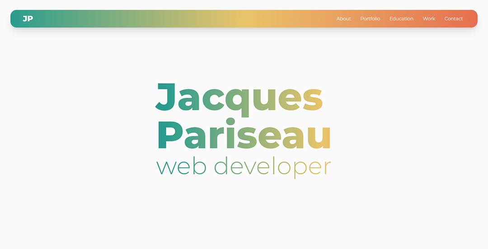

# Jacques Pariseau - Personal Website/Portfolio



## [live site](https://j-par.com)

## Table of Contents

- [Overview](#overview)
- [Challenges](#challenges)
  - [Next/React](#nextreact)
  - [Animation](#animation)
  - [Design](#design)
    - [Mobile](#mobile)
    - [Tailwind](#tailwind-css)
- [Things to Add](#things-to-add)
- [Author](#author)

## Overview

Over the past year in which I've learned web development, I've thought of my portfolio as a major milestone for my journey. I wanted to save it to be the last project before I started applying to jobs. For me, this project was the highest-stakes, as it a representation of me as a developer and designer made manifest in a web app. I'm ultimately very pleasedd with how it came out, and I think it is a very good representation.

My portfolio was a first for me in a couple of ways: my first [Next/React](#nextreact) app and also my first [Tailwind CSS](#tailwind-css) app. I had played around with all of these briefly, but the portfolio was my first attempt at using these tools to build something completely from scratch. Despite this, it went surprisingly quickly--just over a week for full functional implementation.

## Challenges

As this app was a first in many regards, there were a lot of challenges I met along the way:

### Next/React

As this was my first [Next/React](#nextreact) app, I had to shift my mindset and try to do things in a 'React-y' way. There were things that I would have been able to do pretty simply with vanilla JS, but I wanted to use React to its fullest extent. I spent a lot of time referencing docs and reading up on conventions/best practices to try to make my portfolio as successful as possible.

I understood the idea of state, and I had started implementing similar functionality in my most recent Frontend Mentor apps, but I wasn't using it to its fullest extent. I understood ternary operators, too, but I had never relied on them so heavily. I also like that I was able to eschew super long conditional statements in favor of state and `&&` operators. Everything just felt simpler and easier.

I also just found working in this way very exciting. My code came out very clean as I could move all 'complicated' bits into their own components. This felt especially refreshing coming from building [museo](https://github.com/jacqueschuis/museo) which ended up infinitely more complex and harder to read. I have a lot more confidence in my ability to easily dive back in and make edits as I continue to grow as a developer, because everything is simple and easily understood. Take my index for example:

```
 <Head>
    <title>Jacques Pariseau</title>
</Head>
<div
    id="top-section"
    className="md:px-16 px-5 flex flex-col bg-white relative shadow-2xl"
    >
    <Nav />
    <Hero />
    <About />
    <Portfolio />
    <Education />
    <Work />
</div>
<div id="bottom-section" className="relative">
    <Contact />
</div>
<ScrollToTop />
```

I also feel very strongly that the ethos behind React--building reusable components--is much more in-line with my background as a designer. Building the components (which, in this case, were admittedly quite simple) was easy, and then I could devote a lot of time to styling and the actual UI without needing to worry about impacting functionality, as each component is self-contained. I fully plan to build my next applications using React, although I'm planning to play around with a few different frameworks besides Next JS before settling on one.

### Animation

I wanted the application to still feel dynamic and modern, despite its ultimate simplicity. I felt that animations were going to be a key part of accomplishing this from the beginning, but the thought of diving into an animation library scared me.

Initially, I thought I would be best served going with a lighter-weight library, so I chose Tailwind's Headless UI. I only really used the Transition component, and I was never super satisfied with the result. It ended up being quite syntax-intense for what felt like not a lot of payoff. Because of this, I decided to look at other libraries: GSAP, React Spring, Framer Motion.

I wanted something that was going to be React-specific and something that would be useful to me moving forward in my career, so I ruled out GSAP. Framer Motion likely would have been a good choice, but it seemed overly complex on a first glance, and I was wooed by React Spring's incredbily comprehensive (and user-friendly) docs and copious examples.

Getting React Spring up and running was relatively simple, thanks to their docs, but actually fine-tuning everything ended up being quite difficult. As it stands now, I am using springs to control the expanding/collapsing divs throughout the app and the rotating carets on said divs.

### Design

I had many big ideas and a long wishlist for this app. Since I started learning web development, I've spent a lot of time browsing others' portfolios, seeking out elements which I wanted to incorporate into my own eventually. I knew I wanted clean and modern design. I wanted my portfolio to be less-portfolio and more-personal-website--a one-stop shop for everything about me. Because of this, there was a need for large amounts of information, but I didn't want the information to be overwhelming. I wanted the UI to be user-friendly and effortless. I had a lot of big ideas, and they were often hard to reconcile. Similar to [museo](https://github.com/jacqueschuis/museo), I feel like my background in design sets my expectations very high--sometimes higher than my techical development skills would allow. I do feel like working in [Next/React](#nextreact) helped this, as did my usage of [Tailwind](#tailwind-css).

#### Tailwind CSS

When I started coding, I was entirely dependent on Bootstrap, and in recent projects, I've eschewed my reliance on frameworks and focused entirely on writing custom CSS. I feel like I've improved my CSS immensely, and this helped significantly when I decided to try Tailwind, which--in my opinion--as a utility-based framework, requires stronger CSS foundation than Bootstrap does. I found Tailwind to be faster than Bootstrap for me, and I will definitely be using it in the future. The classes are typically only effecting one CSS property, so I also feel like it will integrate better with custom CSS in more complicated apps where this is necessary--there won't be a need to consider overriding Tailwind's classes as they are quite simple.

#### Mobile

I struggled significantly with how to make things mobile-friendly. I went through about 5 iterations of how to handle the expandable descriptions on my entries. They all worked well on desktop, relying on hover effects, but as I sent these versions out to friends to test, almost none of them realized that these elements were interactive as they were viewing the site mostly on mobile. Being cognizant of the fact that many people who will view this app will be doing so via mobile, it was very important to me to find a solution that was clear on both desktop and mobile, and also met my quite-strict design plan. In the end, I went with the pill buttons that you see on the site now, and I think these add a nice pop of color and are clearly clickable on all devices.

## Things to Add

My portfolio is functionally complete. Everything works and looks good, but I do think there is room for growth:

- Animation
  I have implemented better-looking animations with my usage of React Spring, but I have only begun to scratch the surface on the library. I want to dive deeper and get into the useTrail hook in order to animate the hero text on load, but I have yet to find a good way to implement this. React spring has [an example](https://codesandbox.io/s/yps54) in their docs that feels like almost exactly the thing for which I'm looking--or at least like a good starting point, but again, I have so-far been unable to incorporate this into my portfolio.

- Column behavior
  I am ultimately not thrilled by Tailwind's column handler. It is simpler, yes, but I find myself missing the direct control that I would have with Bootstrap columns. I don't like the auto movement of the columns, and I think I would prefer to implement some sort of draggable function through React Spring, or possibly treat each of the categories as its own mini app, with a window for mounting each entry on click, and a list of all the available entries off to the side.

## Author

This website was created from scratch by me, [Jacques Pariseau](https://j-par.com).
